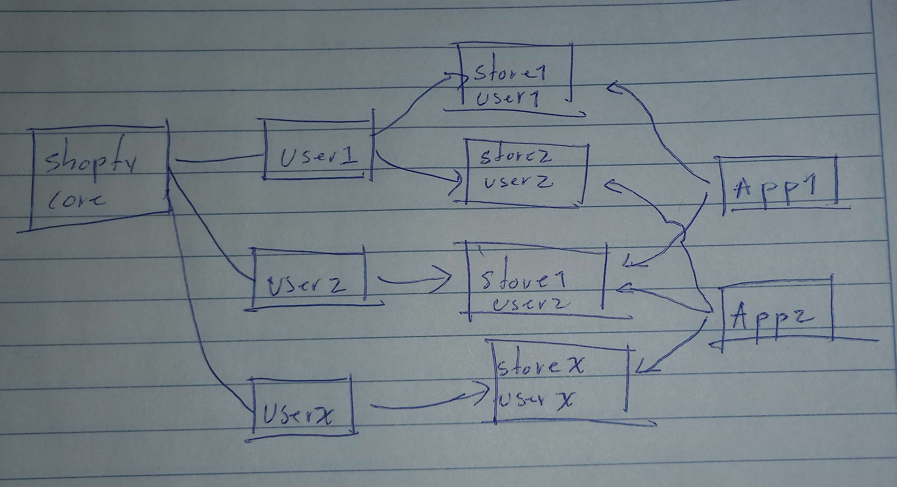
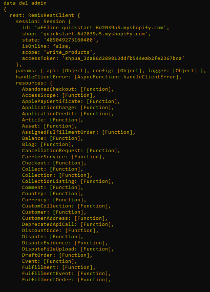

# Shopify funcionamiento (como creo que lo hace por lo menos)


## Funcionamiento de Shopify

Shopify es mucho más que una plataforma para crear tiendas en línea. Simplifica el proceso de administrar una tienda, desde la gestión de productos hasta la atención a los clientes. Lo interesante es que no se limita únicamente a sus propias ideas de automatización. En cambio, ofrece una oportunidad única a la comunidad para que desarrollen aplicaciones personalizadas que se integren con las tiendas existentes en Shopify.

### Simplificación de Tareas Cotidianas

Imagina una tienda en línea: clientes que buscan y compran productos, un equipo de personas que gestionan pedidos y productos... Shopify automatiza gran parte de este proceso, liberando tiempo y recursos. Pero lo que hace aún más impresionante a Shopify es su apertura a la innovación a través de aplicaciones externas.

En lugar de limitarse a crear todas las funciones por sí mismos, Shopify brinda acceso a su plataforma para que desarrolladores externos creen aplicaciones personalizadas. Estas aplicaciones pueden integrarse directamente con las tiendas de Shopify, ofreciendo soluciones únicas y ampliando las funcionalidades de manera significativa.



Este enfoque colaborativo permite un ecosistema diverso, en el que las tiendas pueden personalizar sus experiencias y operaciones con aplicaciones especializadas según sus necesidades.


## Integración de Aplicaciones en Shopify

Shopify ofrece la oportunidad de mejorar las funcionalidades de las tiendas mediante la integración de aplicaciones de terceros. Estas aplicaciones tienen dos formas principales de trabajar:

1. **Integración en el Panel de Administración de la Tienda:**
   - Esta opción requiere la inserción de código HTML dentro de la interfaz de Shopify. La plataforma proporciona una librería llamada [Polaris](https://polaris.shopify.com/), que ofrece componentes JSX para facilitar su implementación.

2. **Funcionamiento en un Servidor Independiente:**
   - Este enfoque permite la ejecución en un servidor separado, lo que resulta útil para características personalizadas. Además, puede permitir la gestión de sesiones de usuarios propios de la aplicación, independientes de Shopify.

### Funcionamiento de las Aplicaciones

En la documentación de Shopify, hay algunos espacios vacios, pero sirve para entender varios procesos de desarrollo de aplicaciones. Por ejemplo, para poner en marcha tu primera aplicación, la documentación emplea la CLI (Interfaz de Línea de Comandos) de Shopify, una herramienta que ejecuta comandos útiles.

Se guía a los desarrolladores a instalar una aplicación utilizando [Remix](https://www.escuelafrontend.com/remix-js), un framework JavaScript que se ejecuta en el navegador y no en el servidor. Una vez instalado, se utiliza el comando `npm run dev` para poner en funcionamiento la aplicación. Luego, se proporciona un enlace que se debe copiar y pegar en el navegador; este enlace instala la aplicación en la tienda. Es probable que aún no tengas una tienda, por lo que la documentación sugiere crear una tienda de desarrollo para probar la aplicación, aunque creeria que esta tienda se crea automáticamente.

La estructura de este enlace es la siguiente:

```
https://{{TIENDA}}/admin/oauth/authorize?client_id={{ID_APP}}&scope={{PERMISOS}}&redirect_uri={{REDIRECT_URI}}
```

- `TIENDA`: Es la tienda a la que se conectará la aplicación.
- `ID_APP`: Representa la clave pública de la aplicación.
- `PERMISOS`: Define los permisos solicitados por la aplicación para su funcionamiento.
- `REDIRECT_URI`: La URL a la que se redirige después de completar el proceso de instalación.

Una vez conectada, podrás visualizar tu aplicación funcionando dentro del panel de administración de Shopify de tu tienda. Esta experiencia te permite comprender el entorno de desarrollo y cómo se integra Remix con la API de Shopify.

Por supuesto, aquí está una versión más comprensible, amigable y formal sobre Remix y su integración con la API:

## Integración de Remix con la API en Shopify

Remix es un framework JavaScript que opera en el navegador y está íntimamente ligado a React. Al crear una aplicación con la CLI de Shopify, se establece un proyecto Remix, localizado en la carpeta `/app`. En la subcarpeta `/routes` se encuentran definidas las distintas rutas o vistas de la aplicación, escritas en formato `jsx`.

### Estructura de Rutas y Funcionalidades en Remix

Las rutas de la aplicación se relacionan directamente con los archivos `.jsx` dentro de la carpeta `/routes`. Por ejemplo, si nombras un archivo dentro de `/routes` como `app.qr.jsx`, se generará una ruta denominada `app/qr`. Al visitar esta ruta, se renderizarán los componentes definidos en el archivo `app.qr.jsx`.

Además, puedes pasar parámetros a través de las URL. Si nombras un archivo como `app.qr.$id.jsx`, `$id` se convierte en un parámetro esperado en la URL. Pero, ¿cómo accedes a estos parámetros y solicitudes? Aquí es donde Remix entra en juego con sus dos funciones principales: `loader` y `action`.

#### Función Loader

La función `loader` se ejecuta justo cuando se visita una URL, antes de renderizar la vista. En esta función, puedes analizar y obtener los datos de la solicitud (`request`) y los parámetros de la URL (`params`).

```jsx
export async function loader({ request, params }){
    // Acceso a la data de la solicitud y parámetros de la URL
}
```

Esta función está diseñada para cargar datos antes de la renderización de la vista. Puedes utilizarla para realizar llamadas a una API externa y renderizar esos datos en la vista.

#### Función Action

La función `action` se activa al enviar un formulario o realizar una acción en la misma página. En esta función, puedes manejar los eventos generados por el formulario o la acción, obtener datos del formulario y realizar acciones basadas en la solicitud.

```jsx
import { useSubmit } from "@remix-run/react";
import { Button } from "@shopify/polaris";
export async function action({ request }) {
    // Procesamiento de eventos de formulario y solicitud
    return null;
}

export default function Index() {
   const summit = useSubmit();

   function sendData(){
      // El primer parámetro de la función summit es la data que se enviará
      // Al enviarse, se ejecutará la función action
      summit({}, { method: 'POST' });
   }

   return(
      <Button variant="primary" onClick={sendData}>Enviar</Button>
   );
}
```

Estas dos funciones son esenciales en Remix para cargar datos y manejar acciones en la aplicación. Además, puedes utilizar otras funciones de React, como `useState` o `useEffect`, de manera habitual para complementar la lógica de tu aplicación.


Por supuesto, aquí tienes una versión más comprensible, amigable y formal sobre cómo usar la API de Shopify desde Remix:

## Uso de la API de Shopify en Remix

El acceso a la API de Shopify desde Remix puede ser algo raro, ya que, al buscar en la documentación oficial en la sección de [API de administración REST](https://shopify.dev/docs/api/admin-rest) y hacer clic en la sección relacionada con `remix`, te redirige a una página de error 404. Entonces, ¿cómo se puede utilizar?

Para entender este proceso, seguí la guía para crear tu primera aplicación con Remix que está en la documentación de Shopify. Esta aplicación se centra en la creación de códigos QR para cada producto. La aplicación debe autenticar la petición que se realiza y para ello utiliza la función `loader`, ya que es la primera que se ejecuta.

```javascript
export async function loader({ request }) {
  const { admin } = await authenticate.admin(request);
}
```

Una vez que la solicitud se autentica correctamente, el objeto `admin` contiene información valiosa que podemos usar para realizar llamadas a la API. Hasta el momento, el objeto `admin` tiene la siguiente estructura:



Como se muestra en el objeto `admin.rest.resources`, allí se encuentran todos los objetos de la API a los que se puede acceder. Por ejemplo, en el archivo `app/routes/app._index.jsx` tenemos un ejemplo en el que accedemos al propietario de la tienda:

```javascript
export async function loader({ request }) {
  const { admin, session } = await authenticate.admin(request);
  const shop = await admin.rest.resources.Shop.all({
    session: session,
  });

  if (shop && shop.data && shop.data.length > 0 && shop.data[0].shop_owner) {
    const ownerShop = shop.data[0].shop_owner;
    return ownerShop;
  } else {
    return "No pudimos saber tu nombre :(";
  }
}
```

Como se puede observar, estas funciones requieren no solo el objeto `admin`, sino también una variable `session` para saber a qué tienda se le hará la llamada a la API. La variable `session` también se puede obtener del método `admin` del objeto `authenticate`, justo como se muestra a continuación:

```javascript
const { admin, session } = await authenticate.admin(request);
```

Esta integración entre Remix y la API de Shopify permite un acceso directo a la API de Shopify desde tu aplicación, facilitando así la manipulación y el uso de los datos almacenados en la plataforma de Shopify dentro de tu aplicación Remix.

# Doc oficial de Shopify App Template - Remix traducida al espanol


## Plantilla para construir una aplicación de Shopify usando el framework Remix

En lugar de clonar este repositorio, puedes utilizar tu gestor de paquetes preferido y el CLI de Shopify con [estos pasos](https://shopify.dev/docs/apps/getting-started/create).

Visita la [documentación de `shopify.dev`](https://shopify.dev/docs/api/shopify-app-remix) para más detalles sobre el paquete de aplicación Remix.

## Inicio rápido

### Requisitos previos

1. Debes [descargar e instalar Node.js](https://nodejs.org/es/download/) si aún no lo tienes.
2. Debes [crear una cuenta de socio en Shopify](https://partners.shopify.com/signup) si no tienes una.
3. Debes crear una tienda para pruebas si no tienes una, ya sea una [tienda de desarrollo](https://help.shopify.com/es/partners/dashboard/development-stores#create-a-development-store) o una [tienda sandbox de Shopify Plus](https://help.shopify.com/es/partners/dashboard/managing-stores/plus-sandbox-store).

### Configuración

Si utilizaste el CLI para crear la plantilla, puedes omitir esta sección.

Usando yarn:

```shell
yarn install
```

Usando npm:

```shell
npm install
```

Usando pnpm:

```shell
pnpm install
```

### Desarrollo local

Usando yarn:

```shell
yarn dev
```

Usando npm:

```shell
npm run dev
```

Usando pnpm:

```shell
pnpm run dev
```

Presiona P para abrir la URL de tu aplicación. Una vez que hagas clic en instalar, puedes comenzar con el desarrollo.

El desarrollo local es impulsado por [el CLI de Shopify](https://shopify.dev/docs/apps/tools/cli). Inicia sesión en tu cuenta de socio, se conecta a una aplicación, proporciona variables de entorno, actualiza la configuración remota, crea un túnel y proporciona comandos para generar extensiones.

### Autenticación y consulta de datos

Para autenticar y consultar datos, puedes utilizar la constante `shopify` exportada desde `/app/shopify.server.js`:

```js
export async function loader({ request }) {
  const { admin } = await shopify.authenticate.admin(request);

  const response = await admin.graphql(`
    {
      products(first: 25) {
        nodes {
          title
          description
        }
      }
    }`);

  const {
    data: {
      products: { nodes },
    },
  } = await response.json();

  return json(nodes);
}
```

Esta plantilla viene preconfigurada con ejemplos de:

1. Configurar tu aplicación de Shopify en [/app/shopify.server.js](https://github.com/Shopify/shopify-app-template-remix/blob/main/app/shopify.server.js)
2. Consultar datos utilizando GraphQL. Consulta: [/app/routes/app.\_index.jsx](https://github.com/Shopify/shopify-app-template-remix/blob/main/app/routes/app._index.jsx).
3. Responder a webhooks obligatorios en [/app/routes/webhooks.jsx](https://github.com/Shopify/shopify-app-template-remix/blob/main/app/routes/webhooks.jsx)

Lee la [documentación de @shopify/shopify-app-remix](https://www.npmjs.com/package/@shopify/shopify-app-remix#authenticating-admin-requests) para entender qué otras API están disponibles.

## Implementación

### Almacenamiento de la aplicación

Esta plantilla utiliza [Prisma](https://www.prisma.io/) para almacenar datos de sesión, utilizando una base de datos [SQLite](https://www.sqlite.org/index.html) por defecto.
La base de datos SQLite funciona en producción si tu aplicación se ejecuta como una única instancia.
La base de datos que mejor se adapte depende de los datos que tu aplicación necesite y de cómo se consulten.
Puedes ejecutar tu base de datos elegida en un servidor tú mismo o alojarla con una empresa de software como servicio (SaaS).
Aquí tienes una lista de proveedores de bases de datos que ofrecen un nivel gratuito para comenzar:

| Base de Datos | Tipo             | Proveedores                                                                                                                                                                                                                      |
| ------------- | ---------------- | -------------------------------------------------------------------------------------------------------------------------------------------------------------------------------------------------------------------------------- |
| MySQL         | SQL              | [Digital Ocean](https://www.digitalocean.com/try/managed-databases-mysql), [Planet Scale](https://planetscale.com/), [Amazon Aurora](https://aws.amazon.com/rds/aurora/), [Google Cloud SQL](https://cloud.google.com/sql/docs/mysql) |
| PostgreSQL    | SQL              | [Digital Ocean](https://www.digitalocean.com/try/managed-databases-postgresql), [Amazon Aurora](https://aws.amazon.com/rds/aurora/), [Google Cloud SQL](https://cloud.google.com/sql/docs/postgres)                                |
| Redis         | Key-value        | [Digital Ocean](https://www.digitalocean.com/try/managed-databases-redis), [Amazon MemoryDB](https://aws.amazon.com/memorydb/)                                                                                                     |
| MongoDB       | NoSQL / Document | [Digital Ocean](https://www.digitalocean.com/try/managed-databases-mongodb), [MongoDB Atlas](https://www.mongodb.com/atlas/database)                                                                                              |

Para utilizar uno de estos, puedes utilizar un [proveedor de origen de datos diferente](https://www.prisma.io/docs/reference/api-reference/prisma-schema-reference#datasource) en tu archivo `schema.prisma`, o un [paquete adaptador de almacenamiento de sesión diferente](https://github.com/Shopify/shopify-api-js/tree/main/docs/guides/session-storage.md).

### Construcción

Remix se encarga de la construcción de la aplicación por ti, ejecutando el siguiente comando con el gestor de paquetes que elijas:

Usando yarn:

```shell
yarn build
```

Usando npm:

```shell
npm run build
```

Usando pnpm:

```shell
pnpm run build
```

## Alojamiento

Cuando estés listo para configurar tu aplicación en producción, puedes seguir [nuestra documentación de despliegue](https://shopify.dev/docs/apps/deployment/web) para alojar tu aplicación en un proveedor de servicios en la nube como [Heroku](https://www.heroku.com/) o [Fly.io](https://fly.io/).

Cuando llegues al paso para [configurar variables de entorno](https://shopify.dev/docs/apps/deployment/web#set-env-vars), también necesitas establecer la variable `NODE_ENV=production`.

## Problemas comunes / Solución de problemas

### Las tablas de la base de datos no existen

Si recibes este error:

```
La tabla `main.Session` no existe en la base de datos actual.
```

Debes crear la base de datos para Prisma. Ejecuta el script `setup` en `package.json` utilizando tu gestor de paquetes preferido.

### La navegación/redirección rom

pe una aplicación incrustada

Las aplicaciones de Shopify incrustadas deben mantener la sesión de usuario, lo cual puede ser complicado dentro de un iframe. Para evitar problemas:

1. Utiliza `Link` de `@remix-run/react` o `@shopify/polaris`. No utilices `<a>`.
2. Utiliza el ayudante `redirect` devuelto desde `authenticate.admin`. No utilices `redirect` de `@remix-run/node`.
3. Utiliza `useSubmit` o `<Form/>` de `@remix-run/react`. No utilices un `<form/>` en minúsculas.

Esto solo se aplica si tu aplicación está incrustada, lo cual es el caso por defecto.

### No incrustada

Las aplicaciones de Shopify son mejores cuando están incrustadas en el panel de administración de Shopify. Esta plantilla está configurada de esa manera. Si tienes una razón para no incrustarla, realiza 2 cambios:

1. Cambia la propiedad `isEmbeddedApp` a false para `AppProvider` en `/app/routes/app.jsx`
2. Elimina cualquier uso de las API de App Bridge (`window.shopify`) de tu código
3. Actualiza la configuración para `shopifyApp` en `app/shopify.server.js`. Pasa `isEmbeddedApp: false`.

### OAuth entra en un bucle cuando cambio los alcances de mi aplicación

Si cambias los alcances de tu aplicación y la autenticación entra en un bucle y falla con un mensaje de Shopify que indica que se intentó muchas veces, es posible que hayas olvidado actualizar tus alcances con Shopify.
Para hacerlo, puedes ejecutar el comando CLI `config push`.

Usando yarn:

```shell
yarn shopify app config push
```

Usando npm:

```shell
npm run shopify app config push
```

Usando pnpm:

```shell
pnpm run shopify app config push
```

### Mis suscripciones a webhooks no se están actualizando

Esta plantilla registra webhooks después de que OAuth se complete, utilizando el gancho `afterAuth` al llamar a `shopifyApp`.
El paquete llama a ese gancho en 2 escenarios:
- Después de instalar la aplicación
- Cuando un token de acceso caduca

Durante el desarrollo normal, la aplicación no necesitará reautenticarse la mayoría de las veces, por lo que las suscripciones no se actualizan.

Para forzar a tu aplicación a actualizar las suscripciones, puedes desinstalarla y reinstalarla en tu tienda de desarrollo.
Eso forzará el proceso de OAuth y llamará al gancho `afterAuth`.

### Pistas incorrectas de GraphQL

Por defecto, la extensión [graphql.vscode-graphql](https://marketplace.visualstudio.com/items?itemName=GraphQL.vscode-graphql) de VS Code asumirá que las consultas o mutaciones de GraphQL son para la [API de administración de Shopify](https://shopify.dev/docs/api/admin). Esto es un valor predeterminado sensato, pero puede no ser cierto si:

1. Utilizas otra API de Shopify como la API del frontend.
2. Utilizas una API de GraphQL de terceros.

En esta situación, actualiza la configuración [.graphqlrc.js](https://github.com/Shopify/shopify-app-template-remix/blob/main/.graphqlrc.js).

## Beneficios

Las aplicaciones de Shopify se construyen con una variedad de herramientas de Shopify para crear una excelente experiencia para el comerciante.

La plantilla de la aplicación Remix viene con las siguientes funcionalidades listas para usar:

- [OAuth](https://github.com/Shopify/shopify-app-js/tree/main/packages/shopify-app-remix#authenticating-admin-requests): Instalación de la aplicación y concesión de permisos.
- [GraphQL Admin API](https://github.com/Shopify/shopify-app-js/tree/main/packages/shopify-app-remix#using-the-shopify-admin-graphql-api): Consultar o modificar datos administrativos de Shopify.
- [REST Admin API](https://github.com/Shopify/shopify-app-js/tree/main/packages/shopify-app-remix#using-the-shopify-admin-rest-api): Clases de recursos para interactuar con la API.
- [Webhooks](https://github.com/Shopify/shopify-app-js/tree/main/packages/shopify-app-remix#authenticating-webhook-requests): Devoluciones de llamada enviadas por Shopify cuando ocurren ciertos eventos.
- [AppBridge](https://shopify.dev/docs/api/app-bridge): Esta plantilla utiliza la próxima generación de la biblioteca Shopify App Bridge que funciona en armonía con las versiones anteriores.
- [Polaris](https://polaris.shopify.com/): Sistema de diseño que permite a las aplicaciones crear experiencias similares a Shopify.

